# SQL Task


## Create Database

```sql
CREATE DATABASE ECOMMERCE;
```
## Use Database

```sql
USE ECOMMERCE;
```

## Create Tables

### Create customers table

```sql
CREATE TABLE CUSTOMERS (
    ID INT PRIMARY KEY AUTO_INCREMENT UNIQUE,
    Name VARCHAR(100),
    Email VARCHAR(100) UNIQUE,
    Address VARCHAR(250)
);
```

### Create orders table

```sql
CREATE TABLE ORDERS (
    ID INT PRIMARY KEY AUTO_INCREMENT UNIQUE,
    CUSTOMER_ID INT,
    ORDER_DATE DATE,
    TOTAL_AMOUNT DECIMAL(10,2),
    FOREIGN KEY (CUSTOMER_ID) REFERENCES CUSTOMERS(ID)
);
```

### Create products table

```sql
CREATE TABLE PRODUCTS (
    ID INT PRIMARY KEY AUTO_INCREMENT UNIQUE,
    Name VARCHAR(100),
    Price DECIMAL(10,2),
    Description TEXT
);
```

## INSERT DATA 

### INSERT DATA INTO CUSTOMER TABLE

```sql
INSERT INTO CUSTOMERS(Name, email, address) VALUES
('Alice', 'alice@example.com','123 Main St,New York'),
('John', 'john@example.com', '234 West St, India'),
('David', 'david@example.com', '345 South St, UK');
```
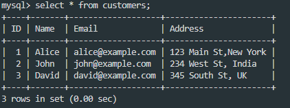

### INSERT DATA INTO PRODUCTS TABLE

```sql
INSERT INTO PRODUCTS (name, price, description) VALUES
('Product A', 25.00, 'Basic product A'),
('Product B', 40.00, 'Premium product B'),
('Product C', 50.00, 'Exclusive product C'),
('Product D', 75.00, 'Luxury product D');
```
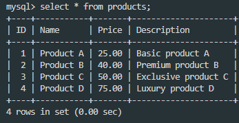

### INSERT DATA INTO ORDERS TABLE

```sql
INSERT INTO ORDERS (customer_id, order_date, total_amount) VALUES
(1, CURDATE() - INTERVAL 5 DAY, 65.00),
(2, CURDATE() - INTERVAL 31 DAY, 200.00),
(1, CURDATE() - INTERVAL 40 DAY, 80.00),
(3, CURDATE() - INTERVAL 2 DAY, 125.00);
```
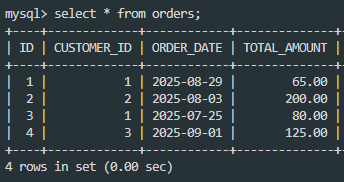


## QUERIES TO WRITE:

### 1.Retrieve all customers who have placed an order in the last 30 days.

```sql
SELECT DISTINCT c.*
FROM customers c
JOIN orders o ON c.id = o.customer_id
WHERE o.order_date >= CURDATE() - INTERVAL 30 DAY;
```
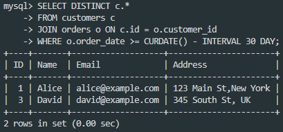

### 2.Get the total amount of all orders placed by each customer.

```sql
SELECT c.name, SUM(o.total_amount) AS total_spent
FROM customers c
JOIN orders o ON c.id = o.customer_id
GROUP BY c.id, c.name;
```
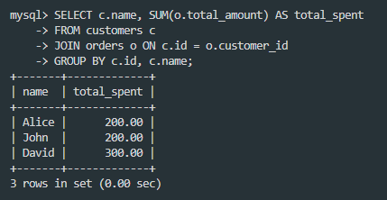

### 3.Update the price of Product C to 45.00.

```sql
UPDATE Products
SET Price = 45
WHERE Price = 50;
```
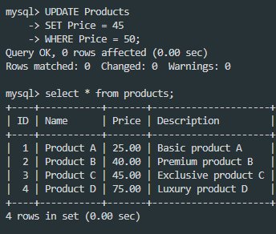

### 4.Add a new column discount to the products table.

```sql
ALTER TABLE Products
ADD COLUMN discount DECIMAL(10,2);
```
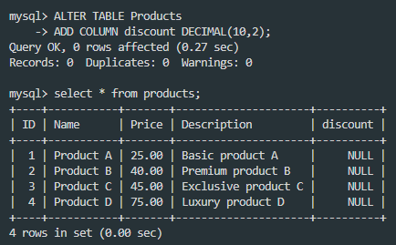

### 5.Retrieve the top 3 products with the highest price.

```sql 
SELECT * 
from products
ORDER BY price DESC
LIMIT 3;
```
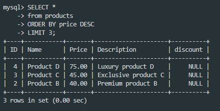

### 6.Get the names of customers who have ordered Product A.

#### Create the order_items table

```sql
CREATE TABLE order_items (
    order_id INT,
    product_id INT,
    quantity INT,
    price DECIMAL(10, 2),
    PRIMARY KEY (order_id, product_id),
    FOREIGN KEY (order_id) REFERENCES orders(id),
    FOREIGN KEY (product_id) REFERENCES products(id)
);
```

#### Insert data into order_items

```sql
INSERT INTO order_items (order_id, product_id, quantity, price) VALUES
(1, 1, 1, 25.00),
(1, 2, 1, 40.50),
(3, 1, 1, 25.00),
(3, 3, 2, 50.00);
```

#### To find the customers who ordered "Product A."

```sql
SELECT DISTINCT c.name
FROM customers c
JOIN orders o ON c.id = o.customer_id
JOIN order_items oi ON o.id = oi.order_id
JOIN products p ON oi.product_id = p.id
WHERE p.name = 'Product A';
```
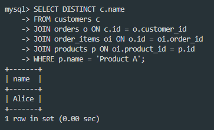

### 7.Join the orders and customers tables to retrieve the customer's name and order date for each order. 

```sql
SELECT c.name AS customer_name, o.order_date
FROM orders o
JOIN customers c ON o.customer_id = c.id;
```
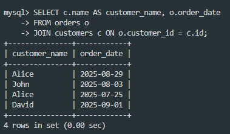

### 8.Retrieve the orders with a total amount greater than 150.00.

```sql
SELECT Total_amount 
FROM orders
WHERE total_amount > 150;
```
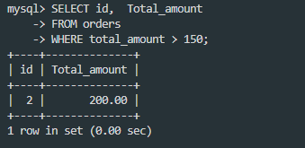

### 9.Normalize the database by creating a separate table for order items and updating the orders table to reference the order_items table.

#### DROP TABLE order_items;

```sql
DROP TABLE order_items; 
```

#### Create orders_items table

```sql
CREATE TABLE order_items (
    id INT AUTO_INCREMENT PRIMARY KEY,
    order_id INT,
    product_id INT,
    quantity INT,
    price DECIMAL(10, 2),
    FOREIGN KEY (order_id) REFERENCES orders(id),
    FOREIGN KEY (product_id) REFERENCES products(id)
);
```

#### Insert values into tables

```sql
INSERT INTO order_items (order_id, product_id, quantity, price)
VALUES
(1, 1, 2, 25.50),
(1, 2, 1, 40.00),
(2, 3, 1, 60.00),
(3, 1, 1, 25.50);
```

```sql
UPDATE orders o
JOIN (
    SELECT order_id, SUM(quantity * price) AS total
    FROM order_items
    GROUP BY order_id
) t ON o.id = t.order_id
SET o.total_amount = t.total;
```
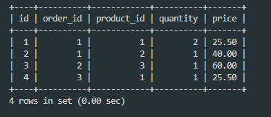

### 10.Retrieve the average total of all orders.

```sql
SELECT id, AVG(total_amount) AS average_order_total
FROM orders;
```
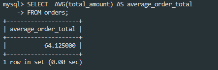